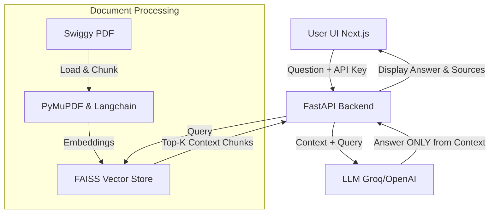

# Swiggy Annual Report RAG Dashboard

## Project Overview
This project is a Retrieval-Augmented Generation (RAG) Question Answering system designed to accurately answer user queries based **strictly** on the Swiggy Annual Report (FY 2023-24). The system is built with a backend in FastAPI and a frontend dashboard in Next.js. 

It prevents hallucinations by heavily prioritizing the retrieved context from a localized FAISS vector store. If an answer cannot be found in the context, it gracefully degrades by stating: *"The information is not available in the Swiggy Annual Report."*

* **Document Source:** [Swiggy Annual Report FY23-24 PDF](https://www.swiggy.com/corporate/wp-content/uploads/2024/10/Annual-Report-FY-2023-24-1.pdf)

## Architecture Diagram


## Tech Stack
* **Python Backend:** FastAPI, Uvicorn
* **AI & Embeddings:** LangChain, HuggingFace (`all-MiniLM-L6-v2`)
* **Vector Store:** FAISS (Local)
* **Frontend:** Next.js (React), Tailwind CSS, Lucide Icons

## Folder Structure
```
rag-swiggy-app/
│
├── data/
│   ├── swiggy_annual_report.pdf
│   └── faiss_index/             # Auto-generated Vector Database
│
├── src/                         # Python Backend
│   ├── load_pdf.py              # Chunking & extraction
│   ├── embed_store.py           # FAISS integration
│   ├── rag_pipeline.py          # LLM & Retrieval constraints
│   └── app.py                   # FastAPI Server
│
├── frontend/                    # Next.js Application
├── requirements.txt
├── README.md
```

## Setup Instructions

### 1. Backend Setup
1. Clone or navigate into the project directory.
2. Create and activate a virtual environment:
   ```bash
   python3 -m venv venv
   source venv/bin/activate
   ```
3. Install dependencies:
   ```bash
   pip install -r requirements.txt
   ```
4. Start the backend Server:
   ```bash
   cd src/
   uvicorn app:app --host 0.0.0.0 --port 8000 --reload
   ```

### 2. Frontend Setup
1. Open a new terminal and navigate to the `frontend` folder.
2. Install npm packages:
   ```bash
   cd frontend
   npm install
   ```
3. Run the development server:
   ```bash
   npm run dev
   ```
4. Open the application at `http://localhost:3000`.

### 3. Usage & Dynamic API Keys
To use the application:
1. Navigate to the GUI Dashboard running at `http://localhost:3000`.
2. Ensure you click **"Build Vector Store"** on the sidebar if `data/faiss_index` does not exist yet.
3. Select your preferred LLM Provider (Groq or OpenAI) from the sidebar.
4. Input your API key. (The key is kept securely in memory and passed to the backend per request).
5. Ask your question in the bottom chat bar. Click "View Retrieved Context" on the response to see exactly where the information was pulled from.

## Hallucination Prevention
**The system strictly generates answers only from retrieved document context, preventing hallucination by design.** 

We specifically instruct the LLM in the `PromptTemplate` to answer ONLY based on the provided context retrieved from `FAISS`. If the context lacks sufficient information, the model's instructions enforce it to respond with: *"The information is not available in the Swiggy Annual Report."*

## Limitations & Future Improvements
* **Limitations:** The simplistic text chunking strategy (`RecursiveCharacterTextSplitter`) might cross conceptual barriers mid-sentence or drop tabular structural formatting. It only retrieves top-k chunks, meaning highly expansive questions might miss full context.
* **Future Improvements:** 
  * Better table extraction using tools like `Unstructured` or multi-modal models.
  * Integrating a hybrid search mechanism (e.g., BM25 combined with vector embeddings) to improve keyword-specific questions.
  * Adding conversational memory to retain follow-up contexts for continuous Q&A sessions.
